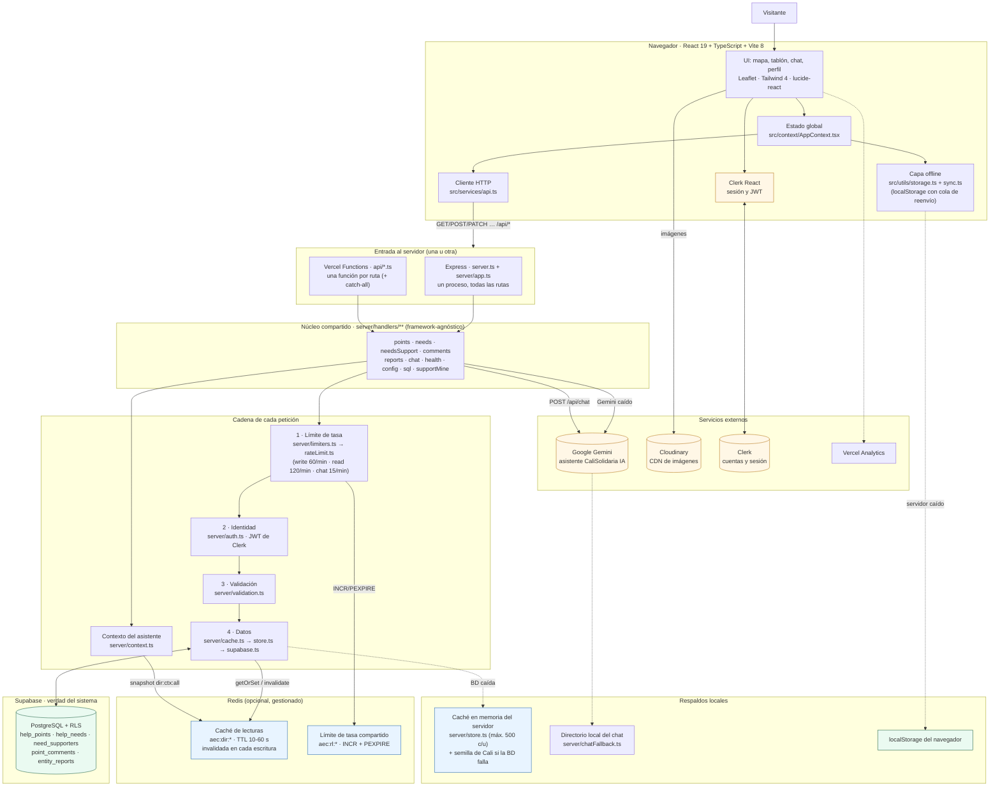
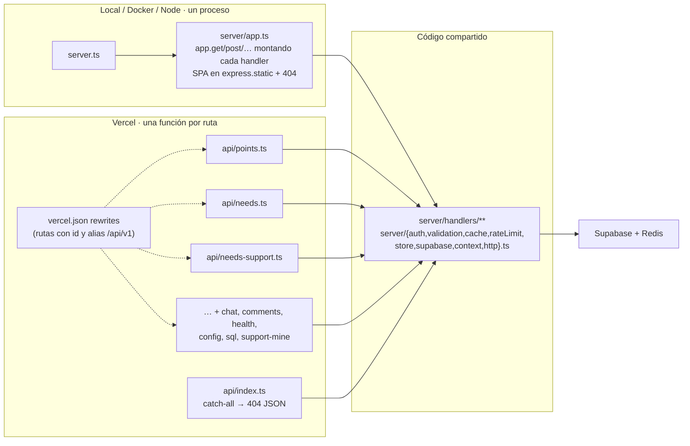
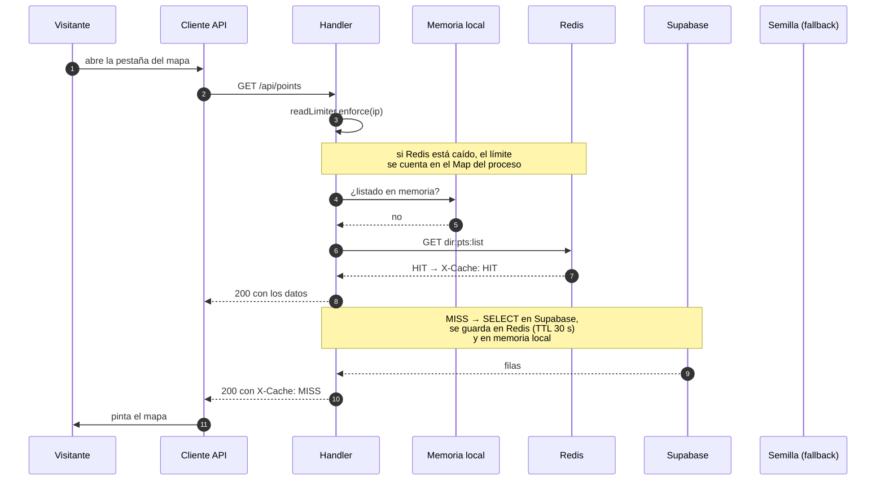
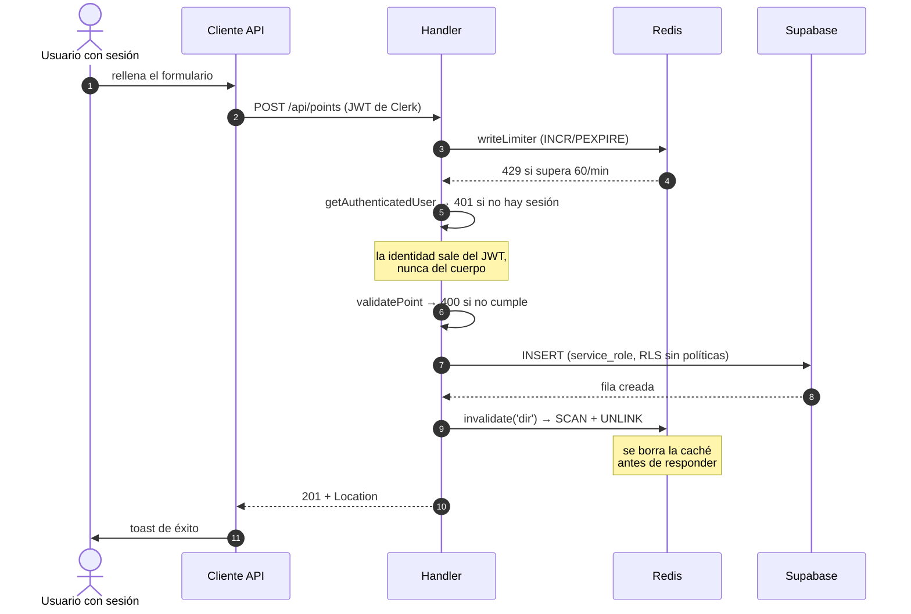
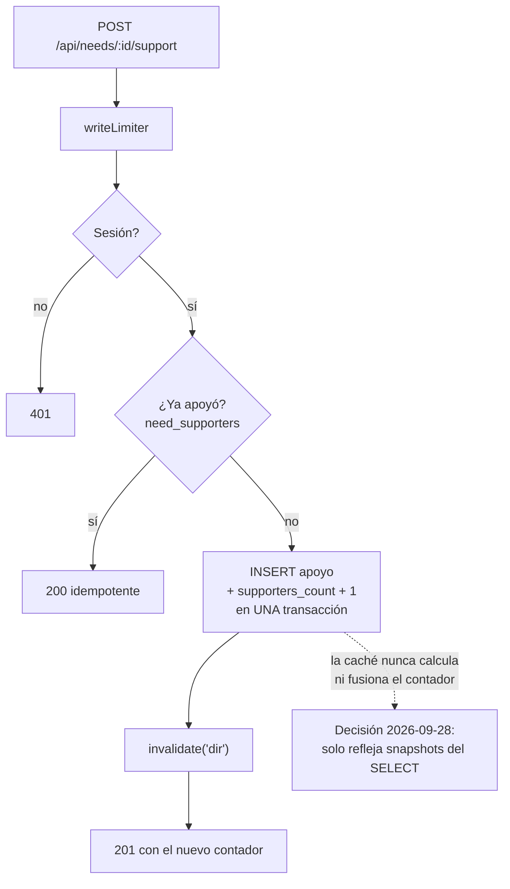
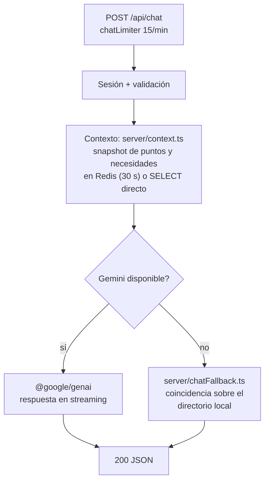
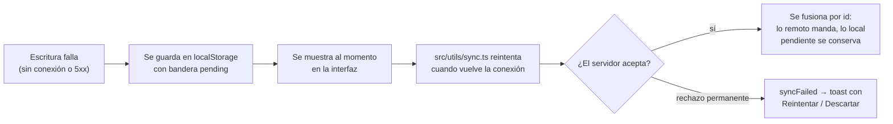

# Arquitectura del sistema

> Diagrama y flujos de **AyudaEnCali**. Documento complementario a
> [`legible/03-tecnologia-infraestructura.md`](legible/03-tecnologia-infraestructura.md)
> (la versión en lenguaje llano) y al árbol de `README.md`.

---

## 1. Visión general

Una plataforma comunitaria de emergencias para Santiago de Cali: mapa de
centros de ayuda, tablón de necesidades con apoyos, asistente IA y perfiles
con roles.

El diseño gira en torno a **tres ideas**:

1. **Un solo núcleo, dos formas de ejecutarse**: los handlers viven en
   `server/handlers/` sin depender de Express; Express los monta en local
   (`server/app.ts`) y Vercel los monta como una función por ruta
   (`api/*.ts`). Misma lógica, distinto proceso.
2. **Cadenas de respaldos, nunca pantalla en blanco**: cada servicio
   externo tiene detrás un respaldo (Redis → memoria local → semilla;
   Gemini → directorio local; servidor → `localStorage` con cola).
3. **La verdad solo está en Supabase**: todo lo demás (Redis, memoria,
   localStorage) es velocidad o respaldo con vida limitada.

---

## 2. Diagrama de componentes



---

## 3. Tecnologías, capa por capa

| Capa | Tecnología | Qué aporta |
| --- | --- | --- |
| Interfaz | **React 19** + TypeScript estricto | Componentes y tipos compartidos con el servidor (`src/types/index.ts`) |
| Compilación | **Vite 8** (+ `@vitejs/plugin-react`) | `dist/` de producción, code splitting por pestaña |
| Estilos | **Tailwind CSS 4** | CSS sin salir de las clases |
| Mapa | **Leaflet** + OpenStreetMap/ArcGIS | El mapa interactivo de Cali |
| Iconos | **lucide-react** | Iconografía |
| HTTP (cliente) | `fetch` envuelto en `src/services/api.ts` | Una sola puerta a la API, reintentos y errores normalizados |
| Almacenamiento cliente | `localStorage` + cola (`src/utils/{storage,sync}.ts`) | Offline-first: ver y escribir sin conexión |
| Servidor | **Node.js + Express** (ESM vía `tsx`) | Un proceso, todas las rutas, en local/Docker/Node |
| Serverless | **Vercel Functions** | Una función por ruta en producción (`api/*.ts`) |
| Núcleo de API | `server/handlers/**` + `server/http.ts` | Handlers sin framework: se montan en Express **y** en Vercel |
| Caché y límites | **Redis** (`ioredis`, opcional) | Respuestas rápidas y un límite de peticiones igual para todos los procesos |
| Caché de respaldo | `server/store.ts` (en memoria) | Si Supabase falla, responde con la última copia o la semilla |
| Base de datos | **Supabase** (PostgreSQL + RLS) | Persistencia, 5 tablas, seguridad en la propia BD |
| Identidad | **Clerk** (`@clerk/clerk-react` + `@clerk/backend`) | Registro, sesión y verificación del JWT en el servidor |
| IA | **Google Gemini** (`@google/genai`) | Asistente «CaliSolidaria IA» |
| Imágenes | **Cloudinary** | CDN con formato automático (`f_auto,q_auto`) |
| Analítica | **Vercel Analytics** | Métricas de visitas |
| Despliegue | **Vercel** (prod) · **Docker** · **Node** | Ver [`legible/02-flujo-despliegue.md`](legible/02-flujo-despliegue.md) |
| Calidad | `tsc --noEmit` · tests jsdom · humo · RLS | CI en GitHub Actions |

**Instalación** (`package.json`): `dotenv`, `express`, `compression`,
`ioredis`, `@supabase/supabase-js`, `@clerk/backend`, `@google/genai`.

---

## 4. El mismo código en dos ejecuciones



| | Express (un proceso) | Vercel (una función por ruta) |
| --- | --- | --- |
| Rutas | Todas en `app.ts` | `api/*.ts` + rewrites de `vercel.json` |
| Caché y límite | En el proceso… | …pero **compartidos en Redis** |
| Estáticos | `express.static` | CDN de `dist/` |
| Cabeceras/CSP | `server/middleware.ts` | `server/vercel.ts` |
| Límite | 12 funciones por deployment | |

---

## 5. Flujos

### 5.1 Lectura de un listado (`GET /api/points`)



- Necesidades: TTL **10 s** (llevan `supporters_count`, el dato que más
  cambia). Puntos: **30 s**. Ítem por id: **60 s**. Contexto del chat: **30 s**.
- Si Supabase falla, `server/store.ts` responde con la última copia en
  memoria o con la semilla de Cali.
- Orden de la lectura: **memoria → Redis → Supabase → (respaldo)**.

### 5.2 Escritura (`POST /api/points`)



El orden de comprobaciones es fijo y documentado en cada handler:
**límite de tasa → sesión → permiso/autoría → existencia → validación →
escritura → invalidación**. Así un ciudadano no aprende qué ids existen
antes de comprobar que tiene permiso.

### 5.3 Apoyar una necesidad (`POST /api/needs/:id/support`)



### 5.4 Asistente (`POST /api/chat`)



### 5.5 Capa offline



---

## 6. Capas de caché y sus vidas

| Nivel | Dónde | Qué guarda | Vida | Quién la borra |
| --- | --- | --- | --- | --- |
| 1 | `localStorage` del navegador | Listados vistos y escrituras pendientes | Hasta que cambie el usuario o el sync | `src/utils/sync.ts` |
| 2 | Redis `aec:dir:*` | Copias de lo que devolvió un `SELECT` | 10-60 s (TTL) | `invalidate()` en cada escritura |
| 3 | Redis `aec:rl:*` | Contadores de peticiones por IP | Ventana de 60 s | Expiración automática |
| 4 | `server/store.ts` | Últimos 500 ítems + semilla | Vida del proceso | Reescrituras y purgas |
| 5 | Supabase | **Verdad** | Permanente | El propio dominio |

Si un nivel falla, se salta al siguiente. Ninguna caché de nivel 2-4 calcula
nunca `supporters_count`: solo copia lo que leyó de la base.

---

## 7. Seguridad

| Control | Dónde |
| --- | --- |
| Sin secretos en el cliente (solo `VITE_*` y `/api/config`) | `.env` gitignored, `server/handlers/config.ts` |
| Identidad siempre del JWT, nunca del cuerpo | `server/auth.ts` |
| Validación total de payloads (tipos, rangos, listas), cuerpo ≤ 1 MB | `server/validation.ts` |
| Límite de tasa por IP en todas las rutas | `server/rateLimit.ts` (Redis) |
| RLS: lectura pública en `help_points`/`help_needs`; **sin políticas** en `need_supporters`, `point_comments`, `entity_reports` (solo `service_role`) | `supabase/schema.sql` |
| Cabeceras de seguridad en `/api/*` (`nosniff`, `X-Frame-Options`, `Referrer-Policy`, `Permissions-Policy`), `x-powered-by` off | `server/middleware.ts` / `server/vercel.ts` |
| Sin stack traces en respuestas (log propio, sin `console.*`) | `server/logger.ts`, `src/utils/logger.ts` |
| Escape de HTML en popups con texto externo | `src/utils/sanitize.ts` |
| Consentimiento de cookies antes de cargar terceros | `src/utils/consent.ts` |
| `GET /api/supabase/sql` protegido con `SQL_ADMIN_TOKEN` | `server/handlers/sql.ts` |

---

## 8. Resiliencia: qué pasa cuando algo cae

| Caída | Efecto | Cubierto por |
| --- | --- | --- |
| Redis | Caché y límite vuelven a la memoria del proceso; nada visible | `server/redis.ts` (circuit breaker), `server/cache.ts` |
| Supabase | La API responde con datos en memoria o semilla | `server/store.ts` |
| Gemini | El chat responde con el directorio local | `server/chatFallback.ts` |
| Servidor | La UI usa `localStorage` y cola lo escrito | `src/utils/{storage,sync}.ts` |
| Excepción de React | `ErrorBoundary` en vez de pantalla en blanco | `src/components/ErrorBoundary.tsx` |

---

## 9. Mapa del código

```
.
├── server.ts                  arranque Express (npm run dev / start)
├── api/*.ts                   Vercel: una función por ruta (+ catch-all)
├── vercel.json                rewrites, cabeceras, alias /api/v1
├── server/
│   ├── app.ts                 monta cada handler en Express
│   ├── bootstrap.ts           dotenv → initSupabase() → initRedis()
│   ├── http.ts                ApiRequest/ApiResult (contrato framework-agnóstico)
│   ├── vercel.ts              createApiRoute(): mismo contrato en Vercel
│   ├── auth.ts · validation.ts
│   ├── limiters.ts · rateLimit.ts     límite de tasa (Redis + Map)
│   ├── cache.ts · redis.ts            caché de lecturas y cliente Redis
│   ├── store.ts                       memoria local + semilla
│   ├── supabase.ts · schema.ts        cliente, mapeo de filas, reintentos
│   ├── context.ts                      contexto del asistente
│   ├── chatFallback.ts                 respaldo del chat
│   └── handlers/                       points needs needsSupport comments
│                                        reports chat health config sql supportMine
├── supabase/schema.sql        DDL + RLS (npm run verify:rls)
├── scripts/                   test, humo, seed, schema, Cloudinary
├── src/                       cliente React
│   ├── context/AppContext.tsx estado global
│   ├── services/api.ts        puerta única a la API
│   ├── utils/{storage,sync}.ts offline
│   └── components/            MapView, ChatView, ProfileView, …
├── .github/agents/*.agent.md  5 agentes de Copilot CLI
├── .opencode/agent/*.md       los mismos 5 para opencode
└── docs/                      este documento, legible/ y agentes/
```

---

## 10. Comandos

| Comando | Para qué |
| --- | --- |
| `npm run dev` | API + Vite en `http://localhost:3000` |
| `npm run lint` / `typecheck` | TypeScript estricto (`noUnusedLocals`, `noUnusedParameters`) |
| `npm run test:ui` | Tests jsdom (`TODO OK` en verde) |
| `npm run test:server` | Humo de los núcleos (sin navegador) |
| `npm run verify:rls` | Valida `supabase/schema.sql` en un Postgres desechable |
| `npm run db:setup` / `db:seed` | Esquema y semilla en Supabase |
| `npm run smoke:vercel` | Humo contra un despliegue (`SMOKE_BASE_URL=…`) |

---

## Documentos relacionados

| Documento | Para qué |
| --- | --- |
| [`legible/01-flujo-app.md`](legible/01-flujo-app.md) | Qué ve una persona al usar la app |
| [`legible/02-flujo-despliegue.md`](legible/02-flujo-despliegue.md) | Cómo se despliega |
| [`legible/03-tecnologia-infraestructura.md`](legible/03-tecnologia-infraestructura.md) | El stack en lenguaje llano |
| [`agentes/decisiones.md`](agentes/decisiones.md) | Por qué las cosas son así (no reabrir sin consenso) |
| [`agentes/uso-agentes.md`](agentes/uso-agentes.md) | Los 5 agentes y cuándo usarlos |
| `README.md` | Referencia rápida, API y variables de entorno |
